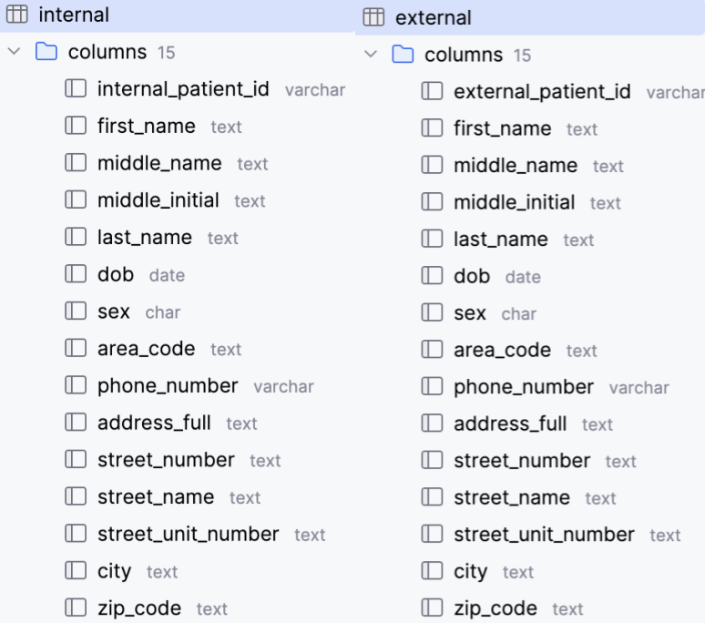
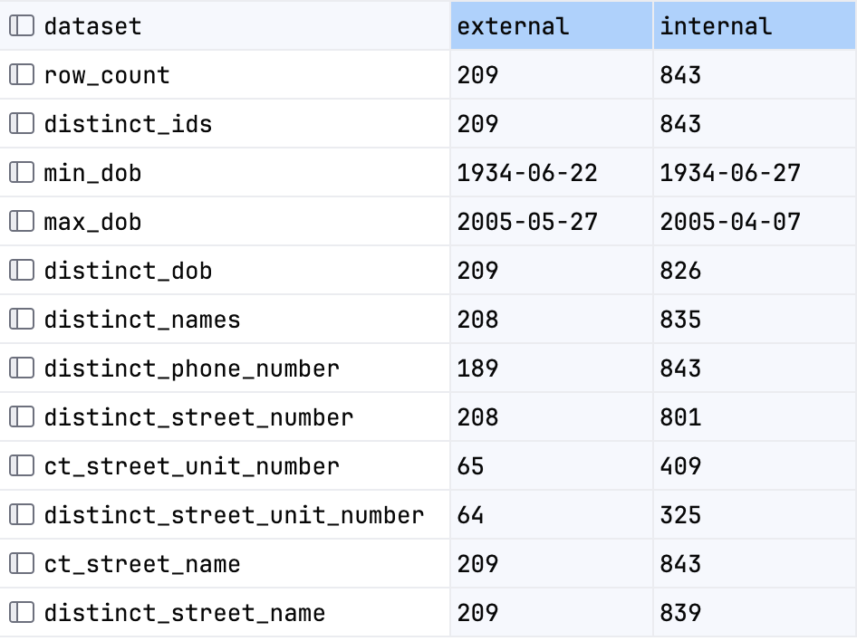

# HCA Patient Matching Ticket

### Table of Contents
<!-- TOC -->
* [HCA Patient Matching Ticket](#hca-patient-matching-ticket)
    * [Table of Contents](#table-of-contents)
  * [Overview](#overview)
  * [Setup / How to Use](#setup--how-to-use)
    * [Single command](#single-command-)
    * [Query Data](#query-data)
  * [Matching Framework](#matching-framework)
  * [Documentation of Work](#documentation-of-work)
    * [Step 1 Initial Stakeholder Questions (skipped)](#step-1-initial-stakeholder-questions-skipped)
    * [Step 2 "Look at the data" step](#step-2-look-at-the-data-step)
    * [Step 3 Set up the environment](#step-3-set-up-the-environment)
    * [Step 4 Create canonical tables of cleansed, typed data](#step-4-create-canonical-tables-of-cleansed-typed-data)
    * [Step 5 Brief EDA on canonicalized tables](#step-5-brief-eda-on-canonicalized-tables)
    * [Step 6 Comparison](#step-6-comparison)
    * [Step 7 Matching and Scoring Algorithm](#step-7-matching-and-scoring-algorithm-)
    * [Step 8 Code Review (skipped)](#step-8-code-review-skipped)
  * [Productionizing this project](#productionizing-this-project)
  * [Time spent](#time-spent)
<!-- TOC -->

----

## Overview

The project [Instructions](docs/instructions.pdf) lay out the goals and purpose of this assignment.

This repository code builds a mini data warehouse, ingests data, transforms and performs matching/scoring.


|                    |                               |
|-------------------:|:------------------------------|
|         Tools Used | docker, postgreSQL, PL/Python |
| Flat files, output | `/data`                       |
|          Documents | `/docs`                       |
|               Code | `/src`                        |

**Data Warehouse Schema and Stored Procedures**


-----

## Setup / How to Use

### Single command 

```zsh
docker compose up
```
1. Runs the docker image
2. Configures the container, environment, and volumes
3. Provisions local postgresql service
4. Ingests flat file data in `/data`
5. Builds downstream tables
6. Writes `matches.csv`

### Query Data

| Database Configuration                                                                                                          |
|:--------------------------------------------------------------------------------------------------------------------------------|
| URL: `jdbc:postgresql://localhost:5432/postgres` </br>USER: `hca_ticket` </br>PASSWORD: `compose.yaml` env: `POSTGRES_PASSWORD` |

-----

## Matching Framework

Using SQL instead of an imperative language makes it easy to consider one stage of the matching logic at a time.

> ingest → build schema → build comparison matrix → apply matching algorithm

The matrix process chosen is **modular, extremely flexible** and can be changed on the fly for this reason.   
There is no _correct_ set of matches until we discuss with stakeholders what data entry errors to tolerate.

The latest iteration of matching [choices](004_scoring.sql) I ended at is below:

| Match Type               | Criteria                                                                                   | Similarity Threshold          |
|--------------------------|--------------------------------------------------------------------------------------------|-------------------------------|
| Single-name DOB match    | First name + Date of birth (+ last name for males)                                         | name > 0.5                    |
| Dual-name DOB match      | Sum both names + Date of birth (+ additional score last name for males)                    | both-names > 1 and name > 0.5 |
| Dual-name Birthday match | Sum both names + Birthday (+ additional score last name for males)                         | both-names > 1 and name > 0.5 |
| Dual-name Phone match    | Sum both names + Phone                                                                     | both-names > 1                |
| Supporting info match    | Sum street address + phone similarity + sex (no matches unless sex requirement is removed) | 1.5 similarity                |

**Exact matches**: Prefix exact matches with `exact_`

**Unconvincing Features**: Other criteria were considered, like `Street Name`, `Street Number`, etc - these did not produce matches that were convincing, because Name and DOB were deviant, and there is a possibility of sibling/married data in this dataset.

**Unused Features**: `middle initial` was discarded due to lack of data. `area code`, `city`, and similar data were not useful - logically speaking candidates in the greater Austin area would migrate between these regions

----

## Documentation of Work

### Step 1 Initial Stakeholder Questions (skipped)

_This step was not completed. It would be my first step in a real-world ticket_.

> * Quick call to gather background from **stakeholder** 
>   * What is the purpose of joining this data?
>     * **risk**: What is the cost of matching patients incorrectly? 
>     * **gain**: What do we gain by matching candidates correctly?
>   * Who is the subject matter expert I can talk to about this data if I have questions?
>   * Is this a one-off task or will we be repeating this exercise in the future?
>     * If lots of future data is coming, we will need to incrementalize the ingest. 
> * Short sync with **Data Team** about PII
>   * The PII in this dataset almost certainly violates our company security policies in a flat file, do we have a process for securely transmitting/receiving and storing this data?
>   * Can we join this to any pre-existing datasets to enrich the data?


### Step 2 "Look at the data" step

**Important**: Before beginning _any_ work - take a quick physical look at the csv files.

Observations:
> * Very similar formats, data is super clean, header provided, column names have capitalization
> * Slightly different date formats
> * Comma-separation is clean, there don't appear to be "internal commas"
> * Some phone numbers are missing the area code
> * Suspicious addresses like `000 Sean Shoal`. Spot check reveals they are fake.
> * There are lots of similar last names. If the data was real I would check if it is family data.
> * All patients appear to be in the greater Austin area
> * Some middle names exist and have periods


### Step 3 Set up the environment

Create a re-useable and portable environment that will work on any machine:
> This environment will include two services, the standard postgres docker hub [image](https://hub.docker.com/_/postgres) and docker administration service.
> A mounted volume bound to the `/src` directory will contain code to build the tables.


### Step 4 Create canonical tables of cleansed, typed data

| Step       | Step                                                                                                                                                                                                             | File                                         |
|------------|------------------------------------------------------------------------------------------------------------------------------------------------------------------------------------------------------------------|----------------------------------------------|
| build.sh   | Tiny bash loop to build all SQL files. <br/>Alternative to using`docker-entrypoint-initdb.d`                                                                                                                     | [build.sh](src/build.sh)                     |
| plpython   | Add HCA's provided functions as PL/Python functions                                                                                                                                                              | [000_plpython.sql](src/000_plpython.sql)     |
| Ingest     | Ingest flat files to data warehouse                                                                                                                                                                              | [001_ingest.sql](src/001_ingest.sql)         |
| Schema     | Create a raw schema `internal`, `external`<br/>Combined view `all_patients` for quick debug/eda<br/>Remove periods<br/>Lower case most fields<br/>Split out address parts, phone area codes, middle name/initial | [002_schema.sql](src/002_schema.sql)         |
| Comparison | Create a cross-joined matrix comparing relevant patient attributes                                                                                                                                  | [003_comparison.sql](src/003_comparison.sql) |
| Scoring    | Apply scoring logic. Create a `matches` view<br/>                                                                                                                                                        | [004_scoring.sql](src/004_scoring.sql)       |


**Canonical fields**

  


### Step 5 Brief EDA on canonicalized tables

EDA on `external` and `internal` is `all_patients` view.



Observations:
> * All patients are 20+ years
> * `internal` has 17 matching DOBs
> * `internal` has a few similar names to look at
> * `external` has missing phone numbers
> * `internal` has lots of matching street numbers and unit numbers
> * `internal` is missing middle names. Some first names have two 

Pattern-seeking EDA. View some top matches to guide us towards good algorithm choices. 
```postgresql
SELECT * FROM all_patients ORDER BY last_name, first_name LIMIT 20;
SELECT * FROM all_patients ORDER BY dob, last_name LIMIT 20;
SELECT * FROM all_patients ORDER BY ... LIMIT 20;
...
```
Observations:
> * First-name mispellings like 'Sara', 'Sarah' are frequent (e.g.EXT0006\INT0025)
> * Miss-typed year/month/day like 
> * Last-name changes occur in the case of married women. Lots of 'false' matches could happen in married couples or sibilings with similar ages and the same addresses.
>   * A 'soft-matches', or family match category could be a secondary consideration
> * Street numbers are too uniform to be real data

### Step 6 Comparison

[Comparison](src/003_comparison.sql) table created to score against.
  
Matching fields were created for scoring logic. 
```postgresql
similarity_first_name
similarity_last_name
similarity_dob
similarity_phone_number
similarity_street_number
similarity_street_name
exact_match_dob
match_birthday
match_sex
match_female_sex
match_street_number
```

### Step 7 Matching and Scoring Algorithm 


This is a business question - we have to decide what tolerance we have for data-entry errors.

| Information        | Importance | Notes                                                                                                                                             |
|--------------------|------------|---------------------------------------------------------------------------------------------------------------------------------------------------|
| First name         | High       |                                                                                                                                                   |
| Last name          | High       | Married and sibling patients can generate false positives.                                                                                        |
| Date of Birth      | High       | Given the span of dates, a date-of-birth collision is a dead giveaway unless the data was intentionally faked to caused to cause collisions.      |
| Sex                | High       | We will assume female last names change frequently. First named changes are extremely rare in the real world, so we will not focus much on those. |
| Area Code          | Low        | Small sample of area codes, phones numbers change often are unreliable                                                                            |
| Phone Number       | High       | An exact phone number match is valuable                                                                                                           |
| Street Number      | Low        | Street numbers help identify married couples, but not individuals                                                                                 |
| Street Name        | Low        | Combine with street numbers                                                                                                                       |
| Street Unit Number | Low        | Not statistically likely any patient in this set lives in the same apartment complex unless this data was intentionally generated with traps      |
| City               | Low        | Small sample of nearby cities. Not precise as an attribute.                                                                                       |
| Zip code           | Low        | Low precision compared to street number. Only includes Austin area.                                                                               |

**Why design it this way?**

Having a [scoring criteria](src/004_scoring.sql) that is separate from matching algorithms allows you to:
* One spot to change scoring thresholds
* The fields are pre-computed - no additional runtime is needed
* Rapidly iterate on choices during a meeting or discussion


**Output**: `matches` view is written to `data/matches.csv`


### Step 8 Code Review (skipped)

_This step was skipped only because this is an evaluation of my work. In a real ticket this step would be critical._

Request colleagues to examine the documentation and code, iterate on their feedback.

----

## Productionizing this project

1. The ingestion step would be incrementalized
2. It would leverage a pre-existing data warehouse
3. Column tests (e.g. `not null`, `max-min range`, `unique`) would be added
4. An out-of-the-box solution for matching would be used that has nicknames, homophones, etc

----
## Time spent

To help calibrate the assignment

|       Task | Time                                                |
|-----------:|:----------------------------------------------------|
|    3 hours | Documentation                                       |
|  0.5 hours | Setup, planning, brainstorming                      |
|     1 hour | Coding `SQL`                                        |
|     1 hour | Viewing, sorting, thinking about the data           |
|    2 hours | Coding `yaml`, `bash`, `PL/Python` troubleshooting  |

_With a managed data warehouse already set up, this project could be completed in 1-2 hours._