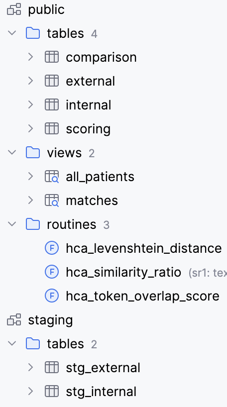

# HCA Patient Matching Ticket

### Table of Contents
<!-- TOC -->
* [HCA Patient Matching Ticket](#hca-patient-matching-ticket)
    * [Table of Contents](#table-of-contents)
  * [Overview](#overview)
  * [Setup / How to Use](#setup--how-to-use)
    * [Single command to build Environment and Ingest/Transform Data](#single-command-to-build-environment-and-ingesttransform-data)
    * [Query Data](#query-data)
  * [Documentation of Work](#documentation-of-work)
    * [1 Initial Stakeholder Questions (skipped)](#1-initial-stakeholder-questions-skipped)
    * [2 "Look at the data" step](#2-look-at-the-data-step)
    * [3 Set up the environment](#3-set-up-the-environment)
    * [4 Create canonical tables of cleansed, typed data](#4-create-canonical-tables-of-cleansed-typed-data)
    * [5 Brief EDA on canonicalized tables](#5-brief-eda-on-canonicalized-tables)
    * [4 Comparison](#4-comparison)
    * [5 Matching and Scoring Algorithm](#5-matching-and-scoring-algorithm-)
    * [6 Code Review (skipped)](#6-code-review-skipped)
  * [Considerations on productionizing this project](#considerations-on-productionizing-this-project)
  * [Time spent](#time-spent)
<!-- TOC -->

----

## Overview

This project ingests flat files containing internal-external patient data, and performs matching between the two datasets.

A mini datawarehouse is provisioned, populated, and built from code by running the docker image.

|                    |                               |
|:-------------------|:------------------------------|
| Tools Used         | docker, postgreSQL, PL/Python |
| Flat files, output | `/data`                       |
| Documents          | `/docs`                       |
| Code               | `/src`                        |

**Mini Data Warehouse**




**Matching Framework**

Using SQL instead of an imperative language makes it easy to consider one stage of the matching logic at a time.

> ingest → build schema → build comparison matrix → apply matching algorithm

The matrix process chosen is **modular, extremely flexible** and can be changed on the fly for this reason. Because some of the matching is subjective "E.g. How much deviation in a candidate's DOB can we tolerate?", it is useful to be able to change our business decisions and view the outcomes immediately. 

There is no _correct_ set of matches until we discuss with stakeholders what data entry errors to tolerate.

The version of matching [choices](004_scoring.sql) I ended at is below:

| Match Type               | Criteria                                                                                   | Similarity Threshold          |
|--------------------------|--------------------------------------------------------------------------------------------|-------------------------------|
| Single-name DOB match    | First name + Date of birth (+ last name for males)                                         | name > 0.5                    |
| Dual-name DOB match      | Sum both names + Date of birth (+ additional score last name for males)                    | both-names > 1 and name > 0.5 |
| Dual-name Birthday match | Sum both names + Birthday (+ additional score last name for males)                         | both-names > 1 and name > 0.5 |
| Dual-name Phone match    | Sum both names + Phone                                                                     | both-names > 1                |
| Supporting info match    | Sum street address + phone similarity + sex (no matches unless sex requirement is removed) | 1.5 similarity                |

**Unconvincing Features**: Other criteria were considered, like `Street Name`, `Street Number`, etc - these did not produce matches that were convincing, because Name and DOB were deviant, and there is a possibility of sibling/married data in this dataset.

**Unused Features**: `middle initial` was discarded due to lack of data. `area code`, `city`, and similar data were not useful - logically speaking candidates in the greater Austin area would migrate between these regions, and it would be hard to justify using one of these fields to 'boost' a low similarity score or a wayward birthday. 

-----

## Setup / How to Use

### Single command to build Environment and Ingest/Transform Data

```zsh
docker compose up
```

This command: 
1. Builds the docker image
2. Runs the container and builds the environment
3. Creates a local postgresql service
4. Ingests the flat file data in `/data`
5. Builds downstream tables
6. Creates `matches.csv`

### Query Data

Connect to the database in an IDE:
* URL: `jdbc:postgresql://localhost:5432/postgres`
* USER: `hca_ticket`
* PASSWORD: Specify in `./.env` as `POSTGRES_PASSWORD`

----

## Documentation of Work

### 1 Initial Stakeholder Questions (skipped)

_This step was not completed. It would be my first step in a real-world ticket_.

* Quick call to gather background from **stakeholder** 
  * What is the purpose of joining this data?
    * **risk**: What is the cost of matching patients incorrectly? (E.g. sending the wrong prescription, sending PII to the wrong mailing address)
    * **gain**: If risk is low, what do we gain by matching candidates correctly?
  * Who is the subject matter expert I can talk to about this data if I have questions?
  * Is this a one-off task or will we be repeating this exercise in the future?
    * If lots of future data is coming, we will need to incrementalize the ingest. 
* Short sync with **Data Team** about PII
  * The PII in this dataset almost certainly violates our company security policies in a flat file, do we have a process for securely transmitting/receiving and storing this data?


### 2 "Look at the data" step

**Important**: Before beginning _any_ work - take a quick physical look at the csv files.

Observations:
> * Very similar formats, data is super clean, header provided, column names have capitalization
> * Slightly different date formats
> * Comma-separation is clean, there don't appear to be "internal commas"
> * Some phone numbers are missing the area code
> * Suspicious addresses like `000 Sean Shoal`. Spot check reveals they are fake.
> * There are lots of similar last names. If the data was real I would check if it is family data.
> * All patients appear to be in the greater Austin area
> * Some middle names exist and have periods

### 3 Set up the environment

Create a re-useable and portable environment that will work on any machine:
> This environment will include two services, the standard postgres docker hub [image](https://hub.docker.com/_/postgres) and docker administration service.
> A mounted volume bound to the `/src` directory will contain code to build the tables.

### 4 Create canonical tables of cleansed, typed data

| Step     | Step                                                                                                                                                                                                             | File                                     |
|----------|------------------------------------------------------------------------------------------------------------------------------------------------------------------------------------------------------------------|------------------------------------------|
| build.sh | Tiny bash loop to build all SQL files. Alternative to using`docker-entrypoint-initdb.d`                                                                                                                          | [build.sh](src/build.sh)                 |
| plpython | Add HCA's provided functions as PL/Python functions                                                                                                                                                              | [000_plpython.sql](src/000_plpython.sql) |
| Ingest   | Ingest flat files to data warehouse                                                                                                                                                                              | [001_ingest.sql](src/001_ingest.sql)     |
| Schema   | Create a raw schema `internal`, `external`<br/>Combined view `all_patients` for quick debug/eda<br/>Remove periods<br/>Lower case most fields<br/>Split out address parts, phone area codes, middle name/initial | [002_schema.sql](src/002_schema.sql)     |


### 5 Brief EDA on canonicalized tables

EDA on `external` and `internal` is `all_patients` view.


Observations:
> * All patients are 20+ years
> * `internal` has 17 matching DOBs
> * `internal` has a few similar names to look at
> * `external` has missing phone numbers
> * `internal` has lots of matching street numbers and unit numbers
> * `internal` is missing middle names

Pattern-seeking EDA. Try to find some matches manually to guide us towards a good algorithm for general use in a big data situation.
```postgresql
SELECT * FROM all_patients ORDER BY last_name, first_name LIMIT 20;
SELECT * FROM all_patients ORDER BY dob, last_name LIMIT 20;
SELECT * FROM all_patients ORDER BY ... LIMIT 20;
...
```
Observations:
> * First-name mispellings like 'Sara', 'Sarah' are frequent (e.g.EXT0006\INT0025)
> * Miss-typed year/month/day like EXT0020/INT0086
> * Last-name changes occur in the case of married women. Lots of 'false' matches could happen in married couples or sibilings with similar ages and the same addresses.
>   * A 'soft-matches', or family match category could be a secondary consideration

### 4 Comparison

[Comparison](src/003_comparison.sql) table created to score against.
  
Matching fields were created for scoring logic. 
```postgresql
similarity_first_name
similarity_last_name
similarity_dob
similarity_phone_number
similarity_street_number
similarity_street_name
exact_match_dob
match_birthday
match_sex
match_female_sex
match_street_number
```

### 5 Matching and Scoring Algorithm 


This is a business question - we have to decide what tolerance we have for data-entry errors (as any entry could potentially be a an error or real value).

| Information        | Importance | Notes                                                                                                                                        |
|--------------------|------------|----------------------------------------------------------------------------------------------------------------------------------------------|
| First name         | High       |                                                                                                                                              |
| Last name          | High       | 'Married' flag will be the second step to remove matches after scoring is done. This field can generate false positives.                     |
| Date of Birth      | High       | Given the span of dates, a date-of-birth collision is a dead giveaway unless the data was intentionally faked to caused to cause collisions. |
| Sex                | High       |                                                                                                                                              |
| Area Code          | Low        | Small sample of area codes, phones numbers change often are unreliable                                                                       |
| Phone Number       | High       | An exact phone number match is valuable                                                                                                      |
| Street Number      | Low        | Street numbers help identify married couples, but not individuals                                                                            |
| Street Name        | Low        | Combine with street numbers                                                                                                                  |
| Street Unit Number | Low        | Not statistically likely any patient in this set lives in the same apartment complex unless this data was intentionally generated with traps |
| City               | Low        | Small sample of nearby cities. Street number and name provide precision                                                                      |
| Zip code           | Low        | Low precision compared to street number. Only includes Austin area.                                                                          |

**Why design it this way?**

Having a scoring criteria that is separate from matching algorithms allows you to:
* One spot to change scoring thresholds
* The fields are pre-computed - no additional runtime is needed
* Rapidly iterate on choices during a meeting or discussion
* During development, it also allows you to quickly try a number of different combinations and get a feel for how good the matches are.

Details on the various types of 'matching choices' are in the [Scoring table and Matches view](src/004_scoring.sql). The scoring and thresholds were adjusted up and down until matches looked reasonable.

**Output**: The output of the final `matches` view is automatically written into `/data`


### 6 Code Review (skipped)

_This step was skipped only because this is an evaluation of my work. In a real ticket this step would be critical._

Have a colleague(s) examine the documentation and code. Then, address their feedback and iterate until the ticket is ready for stakeholders to review.

## Considerations on productionizing this project

1. The ingestion step would be incrementalized
2. It would be incorporated into a pre-existing data warehouse under data governance controls, versioning, and metadata metrics tracking
3. Generic data tests (`not null`, `max-min range`, `unique`, format enforcement, etc) would be added to each column for referential integrity and data format

## Time spent

To help calibrate the assignment

| Time                                               | Task     |
|----------------------------------------------------|----------|
| Documentation                                      | 3 hours  |
| Setup, planning, brainstorming                     | 0.5 hours |
| Coding `SQL`                                       | 1 hour   |
| Viewing, sorting, thinking about the data          | 1 hour   |
| Coding `yaml`, `bash`, `PL/Python` troubleshooting | 2 hours  |

With a managed data warehouse already set up, this project could be completed in 1-2 hours.